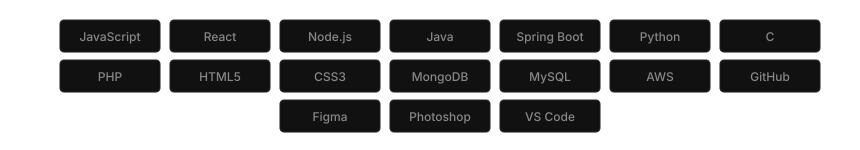

 

 
 

<table>
<tr>
<td valign="top"></td>
<td valign="top"></td>
</tr>
</table>

 
 

<h3 align="center">T E C H   S T A C K</h3>
 

  

 
 

<h3 align="center">C O N N E C T</h3>
 

  
  
  
  

 

